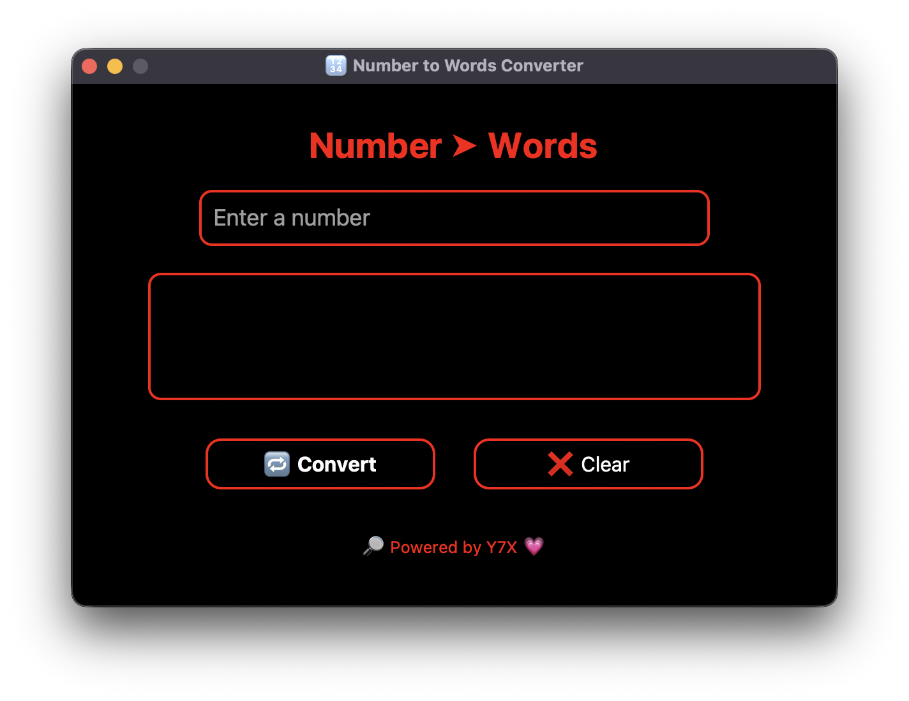

<h1 align="center">🔢 Number to Words Converter</h1>

<p align="center">
  
</p>

<p align="center">
  <b>Turn numbers into words, the aesthetic way. Powered by Python. Styled by Y7X.</b><br>
  <code>AMOLED GUI • Red Outline • White Text • CustomTkinter</code>
</p>

---

## ✨ Features

- 🖤 **True AMOLED** pitch black interface
- 🔴 **Red outlined inputs & buttons**
- ⌨️ Clean entry box with white text
- 🧠 Instant number-to-words conversion
- ❌ Reset with a single tap
- 💗 Footer branding: <b>"🔎 Powered by Y7X 💗"</b>
- 📱 Fully resizable and elegant layout

---

## 🚀 Getting Started

### 1. Clone this repo:
```bash
git clone https://github.com/Y7X-bit/number-to-words
cd number-to-words