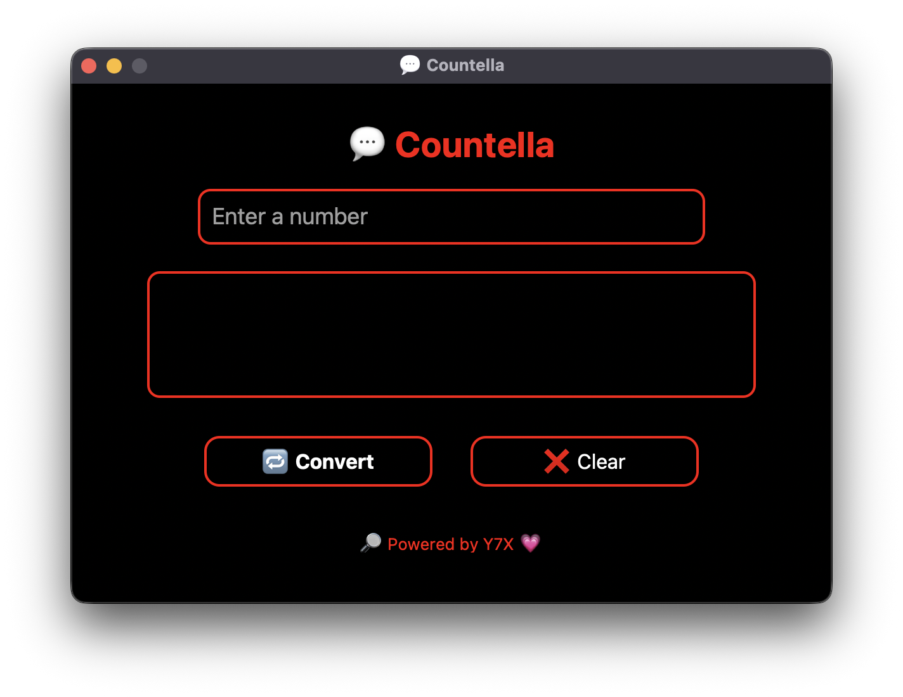

<div align="center">

# 🎯 Countella
**✍️ Words now glow. Numbers bow down.**

Turn numbers into words, the aesthetic way. Powered by Python. Styled by Y7X.
AMOLED GUI • Red Outline • White Text • CustomTkinter
Branded with 💗 by [Y7X-bit](https://github.com/Y7X-bit)



</div>

---

## 🌟 Features at a Glance

- 🖤 **True AMOLED** pitch black interface
- 🔴 **Red outlined inputs & buttons**
- ⌨️ Clean entry box with white text
- 🧠 Instant number-to-words conversion
- ❌ Reset with a single tap
- 💗 Footer branding: <b>"🔎 Powered by Y7X 💗"</b>
- 📱 Fully resizable and elegant layout

---

## 🖥️ Installation

> Python 3.9 or later required

```bash
git clone https://github.com/Y7X-bit/Countella.git
cd Countella
pip install -r requirements.txt
python Countella.py